# Hi, I'm Paribesh Panta 👋

**Software Engineer | AI Systems & Backend Architect**

I specialize in building high-performance backend architectures and researching autonomous AI systems. My work bridges the gap between scalable distributed systems and cutting-edge Multimodal AI (VLMs/SSMs).

---

### 💻 Professional Expertise

- **Backend & Systems Engineering:** Architecting complex document workflow orchestration, automating multi-cloud data exports, and optimizing high-traffic database schemas.
- **AI & Research:** Engineering Vision-Language-Action (VLA) pipelines and Multi-Agent Orchestration (MARS) with a focus on real-time risk modeling and edge-deployment.
- **Security & Scale:** Implementing zero-trust policy gates, OAuth 2.0/JWT integrations, and schema-driven development (Pydantic/Zod).

---

### 🛠️ Technical Toolbox

| Focus Area | Technologies |
| :--- | :--- |
| **Backend** | Python (FastAPI/Flask), MongoDB, Redis, Celery, Kafka, REST APIs |
| **AI/ML Research** | PyTorch, Transformers, Phi-4, CLIP, State Space Models (SSMs) |
| **Agentic AI** | LangGraph, LangChain, MCP Protocol, Multi-Agent Systems |
| **Infrastructure** | CI/CD, ONNX Runtime, TensorRT, Linux, GitHub Actions |

---

### 🧠 Current Interests
- **Multimodal Perception:** Exploring the intersection of Vision-Language Models and real-world robotics/action.
- **Edge Intelligence:** Optimizing heavy LLM/VLM workloads for low-latency inference on edge hardware via TensorRT.
- **Autonomous Agents:** Designing self-correcting agentic workflows for research and automation.

---

### 📈 GitHub Presence

---

### 📫 Let's Connect
- 💼 [LinkedIn](https://www.linkedin.com/in/paribesh-panta-5625482a1)
- 📧 [paribeshpanta44@gmail.com](mailto:paribeshpanta44@gmail.com)
- 📍 Kathmandu, Nepal | 🇳🇵
